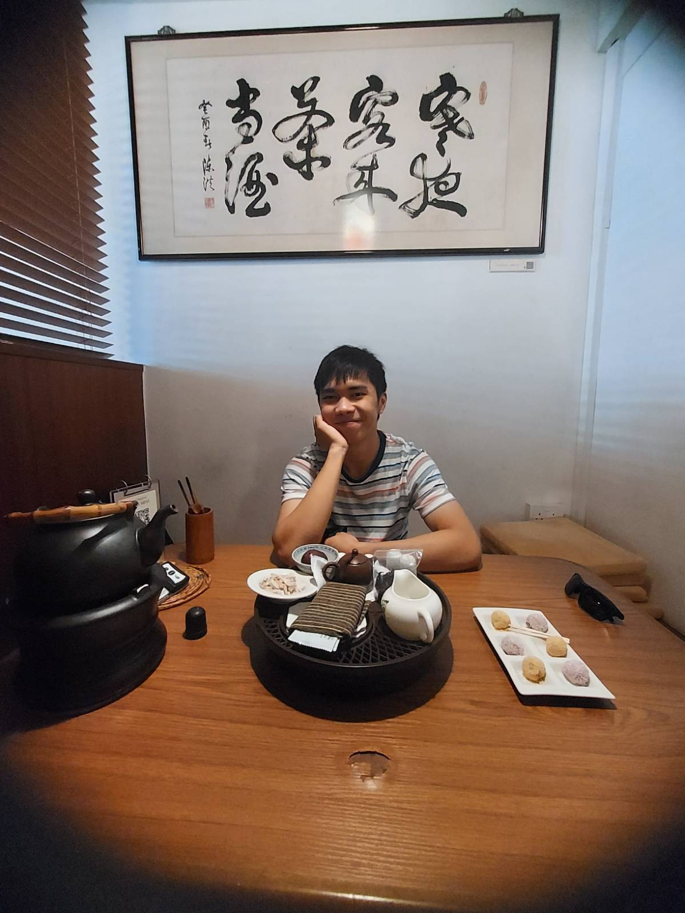

* ToC
{:toc}

# Hello!

Hi! I'm Chester. Welcome to my personal website \:\)

I'm a researcher studying complex systems, and I'm interested in many things including complexity science, network science, physics, free and open source software, and much more! 

I'm currently a research assistant at the National University of Singapore working with [Cynthia Siew](https://csqsiew.netlify.app/) on studying Singapore-English (Singlish) through the lens of network science and psycholinguistics, inspired primarily by the [Small World of Words project](https://smallworldofwords.org/en/project/home).

I was previously at Imperial College London where I did an MSci in \"Physics with Theoretical Physics\", and studied complex systems with some wonderful people at the [Centre for Complexity Science](https://www.imperial.ac.uk/complexity-science) including [Max Falkenberg](https://orcid.org/0000-0002-2986-2494) and [Tim Evans](http://netplexity.org/) and [Kim Christensen](https://www.imperial.ac.uk/people/k.christensen).

Thank you for visiting my website \:\) The following list lists all my other online presences. If you'd like to chat about anything at all please feel free to contact me through your most preferred platform!

# Find Me

* Keyoxide: (OpenPGP Fingerprint) [795cd6a88dc6114f2c1ca652b73642971eafc5b7](https://keyoxide.org/795cd6a88dc6114f2c1ca652b73642971eafc5b7)
* Keybase: [chester_tan](https://keybase.io/chester_tan)
* XMPP: [xmpp@chester-tan.com](xmpp:xmpp@chester-tan.com) \(hosted by [conversations.im](https://conversations.im/)\)
* Matrix: [@chester-tan:matrix.org](https://matrix.to/#/@chester-tan:matrix.org)
* Telegram: [chester_tan](https://t.me/chester_tan)
* Email(s): 
  * Personal:
    * [mail@chester-tan.com](mailto:mail@chester-tan.com) \([ProtonMail](https://protonmail.com/) alias for [mailto:chester.tan13@protonmail.com]\)
    * [chester.tan13@tutanota.com](mailto:chester.tan13@tutanota.com) \([Tutanota](https://tutanota.com/)\)
    * [chester.tan13@gmail.com](mailto:chester.tan13@gmail.com)
  * Institutional:
    * [chester.tan13@imperial.ac.uk](mailto:chester.tan13@imperial.ac.uk)
    * [chester-tan@nus.edu.sg](mailto:chester-tan@nus.edu.sg)
* Mastodon: [@chester\_tan@mastodon.social](https://mastodon.social/@chester_tan)
* Twitter(s): 
  * [chester\_tan\_](https://twitter.com/chester_tan_)
  * [\_chester\_tan](https://twitter.com/_chester_tan)
* GitHub: [chester-tan](https://github.com/chester-tan)

# My Blog

If you'd like you can also visit [my blog](https://chester-tan.com/blog) and subscribe to its [atom feed](https://chester-tan.com/feed.xml) \:\)

# A Photo

And in case you'd like to know what I sort of look like:

# Source Code

This site is built using [Jekyll](https://jekyllrb.com/), hosted by [GitHub](https://github.com), and deployed using [GitHub Pages](https://docs.github.com/en/pages/setting-up-a-github-pages-site-with-jekyll/about-github-pages-and-jekyll). Find its source code [here](https://github.com/chester-tan/chester-tan.github.io).
